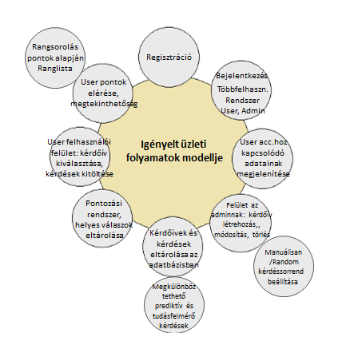

1\. Áttekintés
==============

Az alkalmazás készítése során elsődleges prioritás számunkra a hozzáférhetőség illetve az egyszerűen kezelhetőség. Kerüljük a nem egyértelmű jelek illetve eszközök használatát.

A design kialakítása során törekszünk arra, hogy az alkalmazás használatát egyértelművé tegye, illetve hogy különösebb dokumentáció használatot ne igényeljen az alkalmazás.

Elképzelésünk szerint nem tervezünk mikrotranzakciókat beleépíteni a szoftverünkbe.

3\. Követelménylista
====================
| ID | Leírás |
|----| ------ |
|K01| A Kérdőívek tárolására egy adatbázisban lesz lehetőség, két táblával. Az első táblában a tárolt kérdőívek neve és egyéb általános jellemzői, a másodikban a kérdések és tulajdonságaik lesznek tárolva, az adott kérdést tartalmazó kérdőív azonosítását és kérdéshez kapcsolását lehetővé tevő külső kulccsal együtt.|
|K02| Kérdőívek kitöltésére készül majd felhasználói felület, az elérhető kérdőívek listájából egyet kiválasztva kitölthetjük a kérdőívhez tartozó kérdéseket.|
|K03| Az alkalmazás megnyitása után a felhasználónak be kell jelentkeznie. Meg lesznek különböztetve a felhasználók és adminisztrátorok. Közönséges felhasználóként bárki regisztrálhat, új admin felhasználót a rendszergazda hozhat létre.|
|K04| Új kérdőív hozzáadására az adminisztrátoroknak lesz lehetőségük, a kérdőívek listája alatti új kérdőív gombra kattintva bevihetik a felvenni kívánt kérdéseket és egyéb kérdőívhez kapcsolódó adatokat. A bevitt adatok mentéskor hozzáadódnak az adatbázishoz.|
|K05| Létező kérdőív adatainak módosítására az adminisztrátoroknak lesz lehetőségük, a kérdőívek listájában adott kérdőív nevére kattintva lehetőségük lesz a korábban bevitt adatok módosítására.|
|K06| Létező kérdőív törlése az admin felhasználók jogköréhez tartozik, a kérdőívek listájában az adott kérdőív neve melletti gombra kattintva lehetőség lesz a kérdőív törlésére.|
|K07| A tudásfelmérő és prediktív kérdések egy adatbázis táblabeli attribútum segítségével számon tarthatóak lesznek. A tudásfelmérő kérdéseknél megadható lesz az adott kérdéshez tartozó helyes válasz is.|
|K08| Egy adott kérdőív kitöltésekor a megjelenő kérdések sorrendje admin felhasználók által módosítható. Lehetőség lesz manuálisan beállítható sorrend vagy minden kitöltéskor különböző, véletlenszerű kérdéssorrend alkalmazására is.|
|K09| Az admin felhasználók beállíthatják, hogy egy adott kérdőívben a kitöltők számára meg legyenek-e különböztetve a tudásfelmérő és prediktív kérdések.|
|K10| A kérdőívek kitöltésekor a bevitt adatok egy külön adatbázis táblában lesznek elmentve, ahol a rekordok válaszokat tartalmaznak a hozzájuk tartozó kérdés azonosítójával és egyéb szükséges adatokkal együtt.|
|K11| Lehetőség lesz a tárolt adatok lekérdezésére, a tárolt válaszok szűrhetőek lesznek a hozzájuk tartozó kérdőív, vagy a kitöltést végző felhasználó alapján.|

4\. Jelenlegi üzleti folyamatok modellje
===============================
- Egy kérdőív adatai, benne az összes kérdéssel
> Rendelkezésre áll az összes tudásfelmérő és prediktív kérdések listája

- A tudásfelmérő kérdésekhez tartozó helyes válaszok listája

- Egyetlen megjelenítési lapfelület: nincsenek felhasználói jogkörök => egyfelhasználós rendszer

- Kérdések megjelenítése a monitoron => fix kérdés sorrend alkalmazása

- Kérdésekre válasz => szóban

- Papíron vezetjük a helyes válaszok számát=> személyenként/nevenként pontozva => nem lementhető adatok

5\. Igényelt üzleti folyamatok modellje
===============================
- Online megjelenés

- Kérdőívek tárolása az adatbázisban => kérdőívek neveinek, kérdéseknek az eltárolása

- A prediktív és tudásfelmérő kérdések megkülönböztethetősége =>
> "Az admin felhasználók beállíthatják, hogy egy adott kérdőívben a kitöltők számára meg legyenek-e különböztetve a tudásfelmérő és prediktív kérdések"

- Kiválasztható legyen a kitölteni kívánt kérdőív név alapján => User belépés => Kérdőív lista => Adott kérdőív nevére klikk => kitöltés => beküldés

- Helyes válaszok felvitele az adatbázisba => követhető pontrendszer felhasználónként => rangsorolás => user ranglista helyének megtekintése 

- Bejelentkező felület => Többfelhasználós rendszer => adminisztrátor,közönséges user

- Új kérdőív felvétele az adatbázisba: adminisztrátor jogosultsággal belépés => új kérdőív gomb megnyomása => adatok megadása => véglegesítés

- Kérdőív adatainak módosítása => adminisztrátor jogosultsággal belépés => az adott kérdőív kiválasztása a listából => adatok módosítása => véglegesítés

- Kérdőívek törlése => admin jogosultsággal belépés => Kérdőív neve melletti törlő gomb megnyomása => véglegesítés => adott kérdőív törölve a felületről

- Változatos kérdéssorrend kivitelezése => admin jogosultsággal belépés => kérdőív kiválasztása => kérdéssorrend megváltoztatása => manuális, vagy véletlenszerű

- Kérdőív kitöltése => regisztrált felhasználói belépés => kérdőív kiválasztása => helyes válasz kiválasztása => elküldés

9\. Fogalomtár
==============

Framework: Fejlesztők által létrehozott keretrendszerek, melyek előre definiált beállításokkal rendelkeznek, ezzel is megkönnyítve a fejlesztést.

Back-End: Az alkalmazásunk szerver oldali része, itt futnak az adatbázis műveletek

Front-End: Az alkalmazásunk kliens oldali része, itt futnak a felhasználói műveletek

PHP: A PHP egy általános szerveroldali szkriptnyelv dinamikus weblapok készítésére. Az első szkriptnyelvek egyike, amely külső fájl használata helyett HTML oldalba ágyazható. 

Forrás: https://hu.wikipedia.org/wiki/PHP

Javascript: A JavaScript programozási nyelv egy objektumorientált, prototípus-alapú szkriptnyelv, amelyet weboldalakon elterjedten használnak.

Forrás: https://hu.wikipedia.org/wiki/JavaScript

Laravel: A Laravel egy ingyenes, nyílt forráskódú PHP webkeretrendszer, amelyet Taylor Otwell hozott létre, és amelynek célja a webes alkalmazások fejlesztése a modell – nézet-vezérlő architektúra alapján és a Symfony alapján.

Forrás: https://en.wikipedia.org/wiki/Laravel

Vue.js: A Vue.js egy nyílt forráskódú model–view–viewmodel front-end Javascript keretrendszer mely felhasználói felületek létrehozására, illetve egyoldalú applikációk építésére szolgál. 

Forrás: https://en.wikipedia.org/wiki/Vue.js

MySQL: A MySQL egy többfelhasználós, többszálú, SQL-alapú relációs adatbázis-kezelő szerver.

Forrás: https://hu.wikipedia.org/wiki/MySQL
