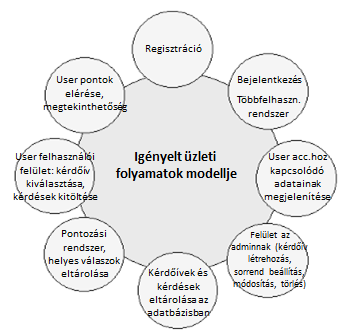

1\. Áttekintés
==============
Az internet és a technológia fejlődésével felgyorsult a világ. A kutatások elvégzésére az emberek válaszaira van szükségünk, melyet korábban papír alapú kérdőívek segítségével szereztek a felmérők, azonban ez a módszer elavult.
Alkalmazásunk célja, hogy az emberek életét megkönnyítsük azáltal, hogy létrehozunk egy alkalmazást, mellyel a résztvevők kényelmesen és könnyedén tudnak válaszolni különböző felméréseken, ezzel időt, energiát illetve utazási költséget spórolva.

Az alkalmazáson belül különféle kérdésekre tudnak válaszolni, melyek lehetnek eldöntendő illetve választó kérdések.
Az alkalmazásban gombokat használva tudunk válaszolni a kérdésekre, majd a kérdőív végén válaszaink kiértékelődnek.

Ezt az alkalmazást a következő fejlesztők készítik:

Balázs Bence, Hernádi Mihály, Osztós Zsombor, Szilágyi Mihály

2\. Jelenlegi helyzet
=====================

- Az internet és a technológia fejlődésével felgyorsult a világ. A kutatások elvégzésére az emberek válaszaira van szükségünk, melyet jelenleg papír alapú kérdőívek segítségével szerzik meg a felmérők, azonban ez a módszer elavult.

- A kérdőívek kitöltőinek személyesen meg kell jelennie, a kérdőívek kitöltéséhez, amely pénzbe és időbe kerül a kitöltő számára.

- A papíralapú adatokat jelenleg egyenként, kézzel kel felvinni az adatbázisba, amely rengeteg idő.

3\. Vágyálom rendszer
=====================

A projekt célja kérdőíveket kitöltő személyek jövőre vonatkozó meglátásainak gyűjtése, valamint öszzefüggések felfedezése a kérdőív szerkezete, a kitöltő adott területhez
kapcsolódó tudása és a predikciók pontossága között.

Ehhez egy olyan webes alkalmazásra van szükségünk, amellyel lehetőségünk lesz kérdőíveket rendezetten és elektronikus formában kezelni. 

Az elkészíteni kívánt rendszerben lehetőség lenne kérdőívek létrehozására, kitöltésére, és a kitöltés közben bevitt adatok lementésére és eltárolására.

További igény, hogy a kérdőívekben legyenek a kitöltő tudását felmérő kérdések, és a jövöre vonatkozó kérdések, amelyekben a
kitöltő megpróbálja megjósólni valamilyen még meg nem történt esemény kimenetelét. Az elkészült alkalmazásban be lehessen állítani, 
hogy a tudásfelmérő és prediktív jellegű kérdések elkülönülnek-e
egymástól.

Szeretnénk azt is megvizsgálni, hogy egy adott kérdőívben a kérdések megjelenésének sorrendje befolyásolja-e a válaszokat, ezért fontos, hogy a kérdések a programmal átrendezhetőek legyenek.

Az elképzelt rendszerben fontos, hogy a kérdőívek tartalmát és megjelenésének módját ne tudja az összes alkalmazást használó személy módosítani, ezért létre kell hozni egy több jogkörrel rendelkező felhasználó típust, valamint egy olyan csoportot, amelynek tagjai csak a kérdőívek kitöltésére jogosultak.

4\. Funkcionális követelmény
=====================
A weboldalnak működnie kell minden ismertebb webböngészőben és operációs rendszer alatt.Magának a webalkalmazásnak könnyen kezelhetőnek jól átláthatónak és esztétikusnak és a felhasználó álltal könnyen kezelhetőnek kell lennie.Az alkalmazásnak képesnek kell online kérdőívek kezelésére.Az alkalmazásnak továbbá képesnek kell lennie ezen kérdőíveknek a létrehozására, a kitöltéseknek a kezelésére és a bevitt adatok lementésére és eltárolására.A kérdőíveknek fét fajta kérdésből kell hogy élljanak, az egyik kategória a kitöltő tudását hivatott mérni, míg a másik a predikciós kategória amelyben a jövőre vonatkozó kérdések kell hogy szerepeljenek.A rendszer kell hogy rendelkezzen lehetőséggel ahol eldőnthetjük hogy a két kategória kérdései elkülönüljenek egymástól.Egy adott kérdőívben a kérdések sorrendje felcserélhetőnek kell hogy legyen további adatszerzés celjából.Az alkalmazásnak rendelkeznie kell egy több részre osztott jogkör rendszerrel ahol elkülönülnek a kérdőívek létrehozására, módosítására jogosult felhasználók és a csupán kitöltési joggal rendelkező felhasználók.

5\. Rendszerre vonatkozó törvények, szabványok, ajánlások
=====================

6\. Jelenlegi üzleti folyamatok modellje
===============================
- Egy kérdőív adatai, benne az összes kérdéssel
> Rendelkezésre áll az összes tudásfelmérő és prediktív kérdések listája

- A tudásfelmérő kérdésekhez tartozó helyes válaszok listája

- Egyetlen megjelenítési lapfelület: nincsenek felhasználói jogkörök => egyfelhasználós rendszer

- Kérdések megjelenítése a monitoron => fix kérdéssorrend alkalmazása

- Kérdésekre válasz => szóban

- Papíron vezetjük a helyes válaszok számát=> személyenként/nevenként pontozva => nem lementhető adatok

7\. Igényelt üzleti folyamatok modellje
===============================
- Online megjelenés

- Kérdőívek tárolása az adatbázisban => kérdőívek neveinek, kérdéseknek az eltárolása

- Kiválasztható legyen a kitölteni kívánt kérdőív név alapján

- Helyes válaszok felvitele az adatbázisba => követhető pontrendszer felhasználónként

- Bejelentkező felület => Többfelhasználós rendszer => adminisztrátor,közönséges user

- Új kérdőív felvétele az adatbázisba: adminisztrátor jogosultsággal belépés => új kérdőív gomb megnyomása => adatok megadása => véglegesítés

- Kérdőív adatainak módosítása => adminisztrátor jogosultsággal belépés => az adott kérdőív kiválasztása a listából => adatok módosítása => véglegesítés

- Kérdőívek törlése => admin jogosultsággal belépés => adott kérdőív törlése => véglegesítés

- Változatos kérdéssorrend kivitelezése

- Kérdőív kitöltése => regisztrált felhasználói belépés => kérdőív kiválasztása => helyes válasz kiválasztása => elküldés

8\. Követelménylista
====================

| ID | Leírás |
|----| ------ |
|K01| Kérdőívek tárolása|
|K02| Kérdőívek kitöltésére felhasználói felület|
|K03| Két felhasználói jogkör kezelése: alap felhasználó, adminisztrátor|
|K04| Új kérdőív hozzáadása|
|K05| Létező kérdőív adatainak módosítása|
|K06| Létező kérdőív törlése|
|K07| Két fajta kérdés: Tudásfelmérő, prediktív|
|K08| Megjelenő kérdések sorrendjének módosíthatósága|
|K09| Kérdés típusa látható vagy nem megjelenített|
|K10| Kitöltött kérdőívek tartalmának eltárolása|
|K11| Lehetőség a tárolt adatok lekérdezésére|

9\. Fogalomtár
==============
User Interface: A felhasználó által használt és látott felhasználói felület.

Main menu: A fő menü, amely a weboldal indulásakor megjelenik.

Login interface: Bejelentkező felület

Database: Adatbázis, melyet kérdések, válaszok és egyéb információk tárolására alkalmazunk.

Design: Az alkalmazás külseje

Questionnaire: Kérdőív

Timer: Idővisszaszámláló

Button: Gomb

Question: Kérdés

Answer: Válasz

10\. Riport
==============

Szabad riport
-------------

Hogyan működjön az új rendszer?

A Kérdőívek tárolására egy adatbázisban lesz lehetőség, két táblával.
Az első táblában a tárolt kérdőívek neve és egyéb általános jellemzői, a másodikban a kérdések és tulajdonságaik lesznek tárolva.
Kérdőívek kitöltésére készül majd felhasználói felület, az elérhető kérdőívek listájából egyet kiválasztva kitölthetjük a kérdőívhez tartozó kérdéseket.
Az alkalmazás megnyitása után a felhasználónak be kell jelentkeznie. Lesznek sima felhasználók és admin felhasználók.
Közönséges felhasználóként bárki regisztrálhat, új admin felhasználót a rendszergazda hozhat létre.
Új kérdőív hozzáadására az adminisztrátoroknak lesz lehetőségük, az új kérdőív gombra kattintva bevihetik a felvenni kívánt kérdéseket és egyéb kérdőívhez kapcsolódó adatokat. A bevitt adatok mentéskor hozzáadódnak az adatbázishoz.
Létező kérdőív adatainak módosítására az adminisztrátoroknak lesz lehetőségük, a kérdőívek listájában adott kérdőív nevére kattintva lehetőségük lesz a korábban bevitt adatok módosítására.
Létező kérdőív törlése az admin felhasználók jogköréhez tartozik, a kérdőívek listájában az adott kérdőív neve melletti gombra kattintva lehetőség lesz a kérdőív törlésére.
Lehetőség lesz manuálisan beállítható sorrend vagy minden kitöltéskor különböző, véletlenszerű kérdéssorrend alkalmazására is, amelyet az admin felhasználók állíthatnak be.
A tudásfelmérő kérdéseknél megadható lesz az adott kérdéshez tartozó helyes válasz is.
Az admin felhasználók beállíthatják, hogy egy adott kérdőívben a kitöltők számára meg legyenek-e különböztetve a tudásfelmérő és prediktív kérdések.
A kérdőívek kitöltésekor a bevitt adatok egy külön adatbázis táblában lesznek elmentve, ahol a rekordok válaszokat tartalmaznak a hozzájuk tartozó kérdés azonosítójával és egyéb szükséges adatokkal együtt.
Lehetőség lesz a tárolt adatok lekérdezésére, a tárolt válaszok szűrhetőek lesznek a hozzájuk tartozó kérdőív, vagy a kitöltést végző felhasználó alapján.
