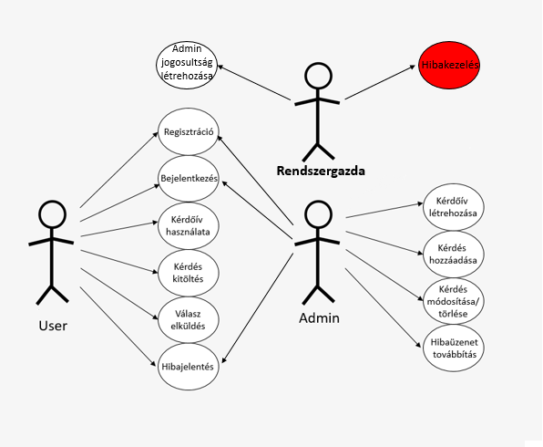
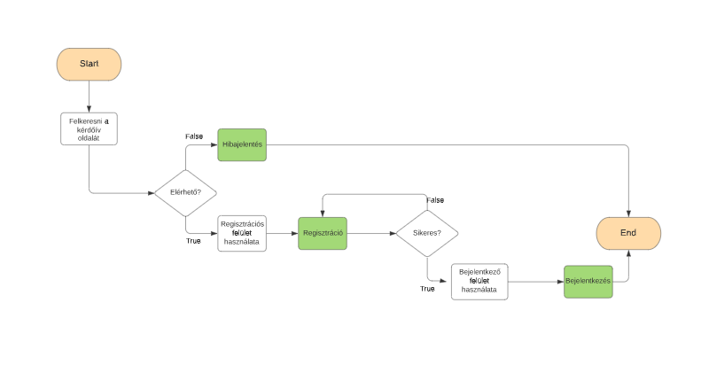
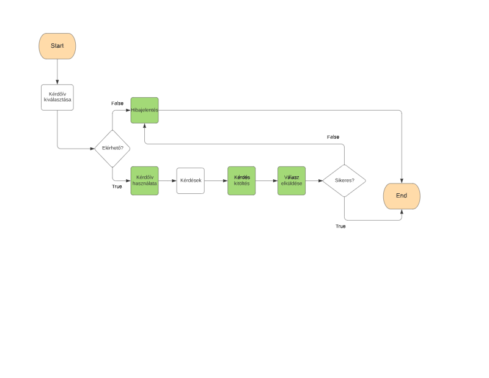
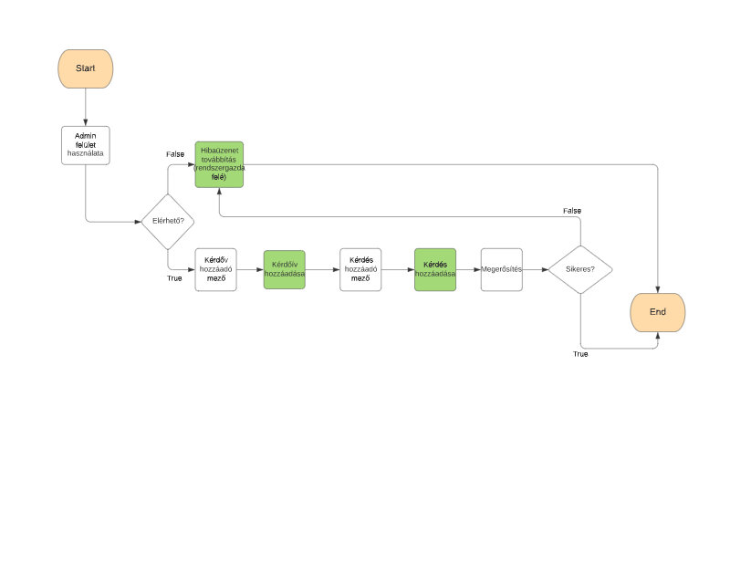
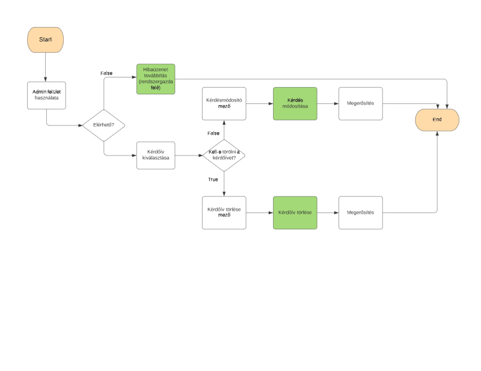
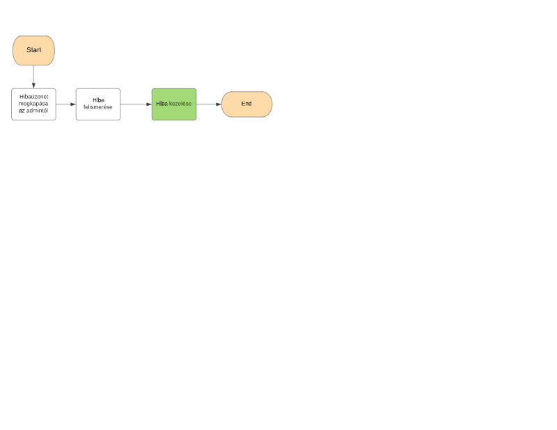

1\. A rendszer célja 
====================

Alkalmazásunk letiszult, illetve egyszerű célokkal rendelkezik. Az emberek véleményeinek kikérdezésének egyszerűsége elsődleges prioritást élvez. Életünk során sokszor veszünk részt különböző felméréseken, de ezeken gyakran ott kell lenni személyesen, a legbonyolításuk túl komplikált vagy gyakran nem rendelkezünk a megfelelő adatokkal, például otthon hagyjuk iratainkat. Ezeket a problémát szeretnénk elsősorban elkerülni.

Mi sem letisztultabb és egyszerűbb annál, hogy elindítjuk az alkalmazást és már hozzá könnyedén tudunk felméréseken részt venni, rengeteg időt, utazási költséget illetve energiát spórolva.

Az átláthatóság és könnyed kezelhetőséget figyelembe véve, a design a mostanában is egyre népszerűbb minimalista megközelítést fogja alkalmazni.

2\. Projektterv
==============
### Projektszerepkörök, felelősségek:
Scrum master: Hernádi Mihály\
Product owner: Osztós Zsombor
### Projektmunkások és felelősségek
**<u> Backend munkálatok:** </u>\
Balázs Bence, Hernádi Mihály, Kiss Marcell, Osztós Zsombor, Szilágyi Mihály\
*Feladatuk a képernyőn található gombok mögöttes funkcióinak beállítása, valamint a háttérben lévő metódusok létrehozása a weboldal minden egyéb funkciójához.
Legfontosabb feladatuk az adatok kezelése: az adatbázisok feltöltése adatokkal, a tárolt adatok rendezése, és az ezekhez szükséges eszközök megteremtése, kivitelezése. Valamint a különböző adatok megkülönböztethetővé és elérhetővé tétele a felhasználó számára. Ezen kívül a többfelhasználós rendszer biztosítása: regisztráció, hatáskörök beállítása, user adatok mentése.*\
**<u> Frontend munkálatok:** </u>\
Balázs Bence, Hernádi Mihály, Kiss Marcell, Osztós Zsombor, Szilágyi Mihály\
*A felsorolt személyek a weboldal elemeinek és adatainak megjelenéséért (a gombok, és egyéb kiegészítők megjelenítéséért: kérdések megjelenítése, pontrendszer feltüntetése, mezők létrehozása, hivatkozások létrehozása) , a lapok megjelenítéséért, logikusan bejárható, összetett, de  esztétikus rendszer kiépítéséért felelősek. A többfelhasználós rendszeren belül külön admin és user felület létrehozása is feladatuk.*

A backend és frontend munkákat együttesen végezzük. A projekt apróbb kódrészenként/részfeladatonként lesz felosztva a csapat tagjai között. Közös egyeztetés alapján mindenki azt a részt fejleszti majd a backend munkálatokban, amelyhez a legjobban ért.

**<u>Ütemterv:**</u>


|  **Funkció/Story** | **Feladat/Task**  |  **Prioritás** | **Becslés**  |**Aktuális becslés**   |  **Eltelt idő**  |**Hátralévő idő**   |
|---|---|---|---|---|---|---|
|Követelmény specifikáció  |   | 0  |5   | 5  |5   |0   |
|Funkcionális specifikáció |   | 0  |6   |6   |6   | 0  |
|Rendszerterv |   |0   |10   |10   |2   |8   |
|Kódháttér elkészítése|Gombok működésének beállítása, adatbázis elkészítése, táblák->adatok felvétele, funkciók beállítása, pontszámláló, hatáskörök és regisztráció biztosítása    |3   |15   |15   |0   |15   |
|Felület elkészítése|Gombok, kérdések, mezők elhelyezése, hátterek és egyéb színek, betűtípusok, stílusok, lapok elkészítése, felhasználói + regisztrációs felület   |2   |10   |10   |0   |10   |
```
```

3\. Üzleti folyamatok modellje
====================

### Üzleti szereplők (Business Actors):
- User
- Adminisztrátor
- Rendszergazda

### Üzleti entitások (Business Entity):
- Regisztrációs felület
- Bejelentkező felület
- Kérdések
- Válaszok
- Kérdőív hozzáadó mező
- Kérdés hozzáadó mező
- Kérdés törlő mező
- Kérdésmódosító mező

### Üzleti folyamatok (Business Use Case):
- Regisztráció
- Bejelentkezés
- Kérdőív használata
- Kérdés kitöltés
- Válasz elküldés
- Hibajelentés
- Kérdőív létrehozása
- Kérdés hozzáadása
- Kérdőív törlése
- Kérdés módosítása
- Hibaüzenet továbbítás
- Admin jogosultság létrehozása
- Hibakezelés

### Üzleti folyamat használati eset diagram (Business Use Case Diagram):


### Üzleti folyamat lefutások (Business Use Case Realization):
1. Regisztráció, Bejelentkezés, Hibajelentés\
Admin és User\

2. Kérdőív használata, Kérdés kitöltés, Válasz elküldés\
User\

3. Kérdőív hozzáadása, Kérdés hozzáadása, Hibaüzenet továbbítás\
Admin\

4. Kérdőív törlése, Kérdés módosítása\
Admin\

5. Hibakezelés\
Rendszergazda\



4\. Követelmények
=================

Funkcionális követelmények:
-------------------------

Az elkészítendő webes alkalmazás böngészőben fut, és kérdőívek online kezelésével foglalkozik.

Lehetőség lesz benne kérdőívek és kérdőívkitöltésekkel kapcsolatos adatok tárolására, valamint lekérdezésére is.

A kérdőívek tartalmazhatnak olyan kérdéseket, ahol a felhasználó szabadon gépelhet be választ, és olyan kérdéseket is, ahol lehetséges válaszok listájából kell megjelölni egy vagy több választ.

A kérdőívekben megadhatóak tudásfelmérő és prediktív jellegű kérdések is, ezeknek kitöltés közbeni elkülönítése paraméterezhető: elkülönítés bekapcsolása vagy tiltása.

A kérdőívekben a megjelenő kérdések sorrendje paraméterezhető: lehetőség van manuális sorrend megadásra és sorrend randomizációra is.

Lehetőség lesz kérdőívek felvételére, tartalmának módosítására és törlésére is.

Két felhasználó típus lesz megkülönböztetve, alap felhasználó és adminisztrátor. Regisztrációkor alap felhasználó jön létre, új admint csak a rendszergazda vehet fel. Bejelentkezés után a megfelelő felhasználói felület jelenik majd meg. 


Nem funkcionális követelmények:
------------------------------

Esztétikus kezelőfelület

Felhasználók ne férjenek hozzá más felhasználók adataihoz

A felhasználóknak jól elkülöníthető jogkörüknek kell hogy legyen

Felhasználóbarát és letisztult kezelőfelület

Törvényi előírások, szabványok:
------------------------------

    -GDPR jogszabályoknak való megfelelés
    
    -2011. évi CXII. törvény az információs önrendelkezési jogról és az információszabadságról
    
    -Fogyatékkal élők érdekében létrehozott hozzáférhetőségi jogszabályok


5\. Funkcionális terv
=================
Rendszerszereplők:
-----------------

Admin

User

Rendszerhasználati esetek és lefutásaik:
-----------------------
ADMIN:

● Beléphet bármilyen szereplőként teljes hozzáférése van a rendszerhez

● A felhasználói adatokat látják, változtathatják

● Felhasználó hozzáadására, törlésére van lehetőségük

● Kérdőívek létrehozása, törlése, módosítása

● Kérdések hozzáadása, törlése, módosítása a kérdőívben

● Kvízek létrehozása, törlése, módosítása

USER:

● Regisztrálhat és bejelentkezhet

● Kiválaszthatja és kitöltheti a számára tetsző kérdőívet

● Elküldheti a kérdőívet

● Kereshet a kérdőívek között

● Hibajelentés küldése

Menü-hierarchiák:
--------------
● BEJELENTKEZÉS:

o Bejelentkezés

o Regisztráció

● MAIN MENÜ

o Keresés a kérdőívek közt

o Kérdőív választása

o Kérdőív létrehozása (Admin)

o Kijelentkezés

● KÉRDŐÍV:

o Kérdőív kitöltése

o Válasz elküldése

6\. Fizikai környezet
=======================
● A backend funkcionalitás megvalósításához a Laravel PHP keretrendszert használjuk, frontend felépítéshez pedig a Vue.js keretrendszert.

● Az alkalmazás web platformra, hordozható
eszközökre(okostelefonok,táblagépek) készül.

● Nincsenek megvásárolt komponenseink.

● Adatok tárolása adatbázisban történik

● Az alkalmazás eléréséhez internetkapcsolat szükséges

● Fejlesztői eszközök:

o Notepad++

o IntelliJ Idea

o MySQL Workbench

o Visual Studio Code

7\. Implementációs terv
=======================

A rendszer két részből áll, egy frontend komponensből, ami a felhasználói felületet és az interakciót biztosítja, és egy backend komponensből, ami a rendszer üzleti logikáját tartalmazza.

A backend funkcionalitás megvalósításához a Laravel PHP keretrendszert használjuk, frontend felépítéshez pedig a Vue.js keretrendszert.

 ## Adatok tárolása - K01, K03, K07, K10
Az adatok tárolása négy adatbázis táblában valósul majd meg, külön táblában tároljuk a felhasználók adatait, a felvett kérdőívek nevét, a felvett kérdéseket, és a kérdőívkitöltéskor lementendő adatokat.

Az adatbázis kezelése a backend komponens szerepköréhez tartozik.

A frontend az adatbázist közvetlenül nem is éri el.

 ## Bejelentkezés, jogosultságkezelés - K03
 A weboldal megnyitásakor először egy bejelentkezés ablak jelenik meg, ahol a megadható a felhasználónév és jelszó.

Frontend: 
Bejelentkezési form megjelenítése, input mezőkben megadott adatok továbbitása a backend komponensnek.

Backend:
A megadott felhasználó név keresése az adatbázisban, jelszó helyességének ellenőrzése. A belépett felhasználó azonosítására használandó token generálása és munkamenet idejéig történő eltárolása(a frontendnek ezt a tokent minden kérésben küldenie kell). A Laravel keretrendszer API token használatával könnyen kezelhető hogy az adott felhasználó a program milyen funkcionalitásait veheti igénybe.

 ## Kérdőívek listája felület - K02, K06
Bejelentkezés után a már elérhető kérdőívek listáját megjelenítő oldal nyílik meg. Ezen a felületen a felhasználónak lehetősége van kérdőív kitöltést kezdeni, admin felhasználóknak pedig új kérdőívet létrehozni vagy már meglévőt módosítani vagy törölni.

Frontend:
A kérdőívek nevét tartalmazó, backend végponttól megkapott JSON objektum feldolgozása és tartalmának megjelenítése egy listában. Admin felhasználók számára új kérdőív valamint kérdőív törlés gomb megjelenítése.

Backend:
Az adatbázisban tárolt kérdőívnevekből JSON objektum előállítása és továbbítása a frontend komponensnek.

 ## Kérdőív kitöltése felület - K02
A kérdőív listában egy kérdőív nevére kattintva az alkalmazás átvált a kérdőív kitöltés felületre.

Frontend: 
JSON objektumban megkapott adatok (kitöltendő kérdőív név, kérdések) megjelenítése a képernyőn. Kitöltés után a mentés gombra kattintáskor a bevitt adatokból megfelelő JSON objektum létrehozása és elküldése a megfelelő backend végpontnak.

Backend:
A kiválasztott kérdőívhez tartozó kérdések kiszűrése az adatbázisból és továbbítása JSON formában, valamint a kitöltési adatok lementése a megfelelő adatbázis táblában.

 ## Új kérdőív létrehozása, létező módosítása - K04, K05
Az admin fehasználók számára a kérdőívek listáját tartalmazó felületen lehet elkezdeni egy új kérdőív felvételét, valamint meglévő kérdőív adatainak és beállításainak módosítását.

Frontend:
Létrehozáskor a felhasználó által megadott beállítások alapján generálandó kérdőív továbbítása JSON objektumként. Módosításánál API függvényhívások használatával juttatjuk át az információt a backend komponensnek, megadjuk hogy mely adatokat milyen módon kell módosítani.

Backend:
Létrehozáskor a megkapott JSON objektumból létrehozott entitás beszúrása az adattáblákba. Módosításnál a már meglévő rekordok megváltoztatása történik.

 ## Kérdőív megjelenésének paraméterezhetősége - K08, K09
Az admin felhasználók számára elérhető kérdőív létrehozó és szerkesztő nézetekben beállítható, hogy a tudásfelmérő és prediktív kérdések elkülönüljenek-e. Szintén megadható az egyes kérdések kitöltéskori sorszáma, vagy a sorszám randomizálást választva a sorrendet véletlenszerűre lehet állítani.

Frontend: 
Az admin felhasználó által megadott beállításokat továbbítja a backend komponens felé.

Backend: 
A beállításoknak megfelelő állapot létrehozása a kérdéseket tartalmazó adatbázis táblában.

 ## Kitöltési adatok lekérdezése - K11
Kérdőív kitöltési adatok lekérdezésére egy külön nézetben lesz lehetőség, a szűrési feltételek megadása után táblázat alakjában jeleníthetőek meg az egyes kérdésekre adott válaszokat tartalmazó rekordok.

Frontend: 
Szűrési input mezők tartalmának továbbítása a backend komponens felé, a szűrés eredményeként kapott rekordok megjelenítése.

Backend:
A megkapott szűrési feltételekből adatbázislekérdezések létrehozása, az illeszkedő rekordok továbbítása a frontend komponensnek.


8\. Tesztterv
==============
Egy alkalmazás készítésekor illetve az alkalmazás kiadása előtt nagyon fontos szerepet töltenek be a teszttervek.

A teszttervek segítségével tudunk különféle funkciók helyes működéséről meggyőződni, illetve a különféle üzleti szolgáltatások hitelesítéséről.

A szoftver kiadása előtt 2 tesztet hajtunk végre, melyek az alpha illetve beta tesztek.

Alpha teszt
Az alpha tesztet a fejlesztő csapat fogja elvégezni.

Ezen teszt során azt vizsgáljuk, hogy az alkalmazás hogyan reagál különboző böngészői környezetekben, illetve az adott funkciók működőképesek-e.

Ha azt tapasztaljuk, hogy az előző feltételek megfelelnek, akkor sikeres volt az alpha teszt, és következhet majd a beta teszt.

Beta teszt
A beta tesztet a fejlesztő csapattól független, kívülálló emberek fogják végezni.

Ennek a tesztnek az a célja, hogy a felhasználóktól visszajelzést kapjanak a fejlesztők az alkalmazás működését illetően.

Amennyiben hibás működésbe ütköznek a felhasználók, akkor egy tesztelési naplóban felvezetik a tapasztalataikat, és azt visszaküldik a fejlesztőknek, a fejlesztők pedig megoldják a felmerült problémákat.

Tesztelésre használt eszközök
Böngészők: Google Chrome 93.0.4577.82-es stabil asztali verzió, Mozilla Firefox 92.0-s stabil asztali verzió, Microsoft Edge 93.0.961.52-es stabil asztali verzió Operációs rendszer: Windows 10 21H1-es stabil asztali verzió

9\. Telepítési terv
===================

A szoftver webes felületéhez csak egy ajánlott böngésző telepítése szükséges (Google Chrome, Firefox, Opera, Safari, Microsoft Edge), külön szoftver nem kell hozzá. A webszerverre közvetlenül az internetről kapcsolódnak rá a kliensek. A hardwares minimális specifikációk meg fognak egyezni egy átlagos weboldal specifikációival és adatforgalmban sem fog eltérni tőle. A weboldal használatához egeren, billentyűzeten kívül más külső hardwarerre nem lesz szüksége a felhasználónak a weboldal használatához.
